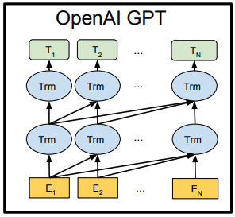

# 汎用言語表現Model　BERTの紹介

経済学部４年　長谷川　一旗

---

## Introduction

--

### 論文紹介のモチベーション
マーケティングの分野でも、様々な自然言語処理のタスクが存在する

論文の重要なポイントやマーケティングでのタスクにおいてどのように応用できそうかということを紹介・検討したい

--

## 言語モデルの変遷

そもそも、言語モデルって？？

--

言語の意味的な情報（特徴）をモデリングしたもの

--

## 古典的な言語モデル
Bag of words …　文章中の単語の出現頻度によって単語を特徴づけ、文章を表現するモデル

--

n-gram モデル　…　n個前の単語の組み合わせによって、次の単語の発生確率を表現するモデル

--

## Word2vec
2層のNNを用いて、単語を分散表現に置換して単語の意味を表現するモデル

--

- Continus Bag of Words
- Skip-Gram

--

### 事前学習（Pre-training）

--

「表現学習」・・・有効な特徴の組み合わせを機械学習を用いて自動的に学習させる

--

「事前学習」・・・様々なタスクへの応用を前提とした表現学習をしたもの

ディープラーニングの登場により、より複雑な特徴量を抽出でき、大規模なデータにかけることにより、汎用性も獲得

--

自然言語処理では、特徴の出現がスパースになりやすい
⇒ 事前学習の重要性が増大

--

あるタスク（感情分析など）を解くのに必要な特徴が、入力として与えるデータに現れない場合もあるが、事前学習させたモデルを使えば補完することが可能

---

## 汎用言語モデル　「BERT」

従来の手法のとBERT手法の紹介

--

### Feature-basedアプローチ
単語や文章などにベクトル表現を与える（Embedding）ことで、特徴量としてとらえる手法

--

- N-gramモデル
- Word2vec
- ELMo(Peters et al., 2017, 2018)

--

### Fine-tuningアプローチ
一般的なデータで事前学習して得られた言語モデル（次の単語を予測するようなモデル）を用いて、特定のタスクの教師ありデータで再度学習することで、そのタスクにおける精度を向上させる手法。

--

- OpenAI GPT(Radford et al. 2018)
単方向Transformer型のモデル

--

- BERT
双方向Transformer型のモデル

--

### Transformerって？

--

従来、自然言語処理の機械学習といえば、RNNやCNNだった
⇒　いや、そんなの使わなくても**Attention**（Łukasz Kaiser et al., arXiv, 2017/06）を用いればいいよ！

--

つまり、TransformerとはAttentionのみを使用したニューラル翻訳モデルだそうです。(Attantionの説明は省略)

---

## 従来の手法と BERT の違い

--

### OpenAPI GPT
現在の単語予測プロセスの際に、予測するべき未来の単語情報を用いてはいない
⇒　使うと、カンニングになってしまい、予測としては不適合

ゆえに、**単方向**Transformer

--

--

### ELMo
順方向LSTMと逆方向LSTMを別々に学習させ、連結することで双方向の文脈を取り入れた。

⇒　双方向を**同時に**学習させることができない

--

--

### BERT
二つの事前学習タスクを用いることで、**双方向**かつ**同時に**学習させることに成功

--

--

モデル側に制約を加えるのは、難しいのでデータ側に制約を加えた二つのタスクを課した。
1. Masked LM
2. Next Sentence Prediction

--

### Masked Language Model
**穴埋め問題**

系列の15％を特殊な[MASK]トークンに置換し、置換した部分を予測する事前学習をさせる。

--

15％のうち、
1. 80%は、そのまま[MASK]トークンのままに
2. 10%は、ランダムな単語に置換
3. 10%は、正しい単語に置換

これにより、Fine-tuning時とのギャップを軽減している（らしい）

--

この穴埋め問題により、「**前後の文脈を考慮できる**」特徴量を抽出

--

### Next Sentence Prediction
**隣接文予測問題**

二つの文章を与え、連続しているかをYes/Noで判定
文章AとBが与えたとき、50%の確率で別の文章Bに置換。

--

この隣接文予測により、「**文章間の関係を捉える**」特徴量を抽出

---

### BERTモデルの功績

(引用：https://twitter.com/_Ryobot/status/1050925881894400000)

---

## マーケティング分野での応用の検討
1. レビュー文の感情分析時の精度向上
2. Twitterのテキストデータをトピックモデルにかけるとき
    - ユーザ一人のツイートを一つの文書として取り扱う
    - 1ツイートを一つの文書として取り扱う
後者の場合、情報量の不足が懸念されていた。
⇒　連続ツイートが連続しているか判断することで一つの文書として取り扱えるので、情報量を補うことができるのではないか

--

他にも何か応用できないか検討していきたい

---

## 参考文献
1. BERT: Pre-training of deep bidirectional transformers for language understanding (Jacob Devlin et al., arXiv, 2018/10)
2. Attention Is All You Need (Łukasz Kaiser et al., arXiv, 2017/06)
3. Matthew Peters, Mark Neumann, Mohit Iyyer, Matt
Gardner, Christopher Clark, Kenton Lee, and Luke
Zettlemoyer. Deep contextualized word representations. In EMNLP2018, pp. 2227–2237, 2018

--

4. Alec Radford, Karthik Narasimhan, Tim Salimans,
and Ilya Sutskever. Improving language understanding with unsupervised learning. Technical report, OpenAI, 2018.

--

## 参考サイト
1. https://qiita.com/Kosuke-Szk/items/4b74b5cce84f423b7125
2. http://yasuke.hatenablog.com/entry/2018/12/25/195319
3. http://deeplearning.hatenablog.com/entry/menhera_chan
4. https://ishitonton.hatenablog.com/entry/2018/11/25/200332

---
